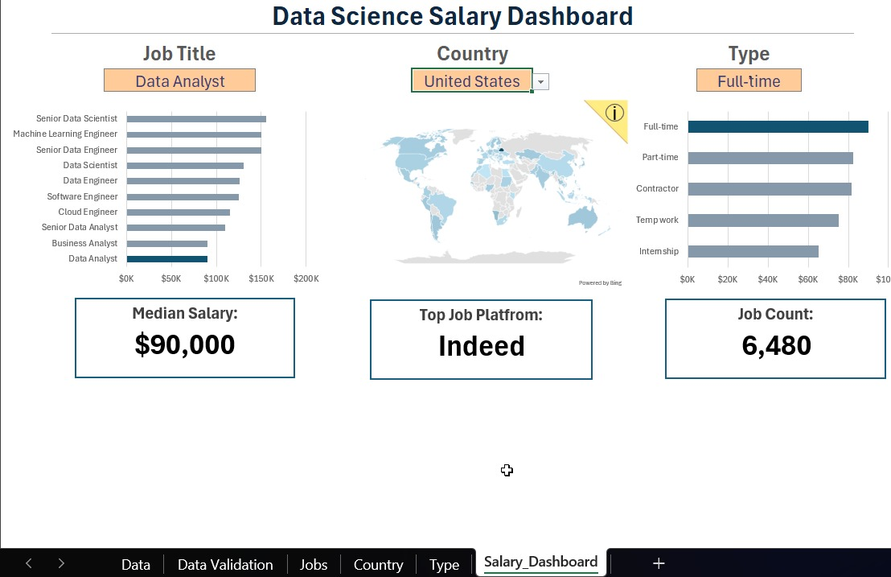

>> Data Science Job Market & Salary Dashboard <<

>> Project Overview
An interactive Excel dashboard designed to analyze global data science job market trends, salaries, locations, and employment types. This project translates raw market data into structured visual insights to support strategic hiring and career planning decisions.

>> Key Features & Visualizations
* **Interactive Filtering:** Built-in slicers for Job Title, Country, and Employment Type for multi-dimensional data exploration.
* **Geographical Mapping:** Integrated a dynamic world map to visualize regional job concentration.
* **Key Metrics Cards:** High-level overview displaying Median Salary ($90,000 for Data Analysts), Top Job Platform (Indeed), and overall Job Count (6,480).

>> Dashboard Preview

>> Tech Stack & Skills Used
* **Data Cleaning:** Standardized messy records, handled missing values, and eliminated data redundancies.
* **Analysis:** Pivot Tables, Data Validation formulas, and descriptive statistics.
* **Design:** Custom charts, dashboard formatting, and KPI card layouts.
